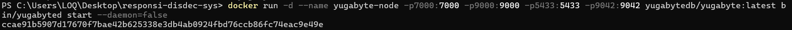
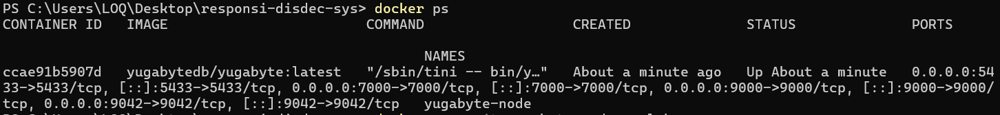
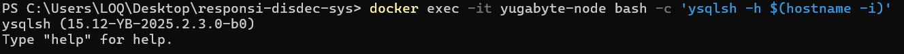
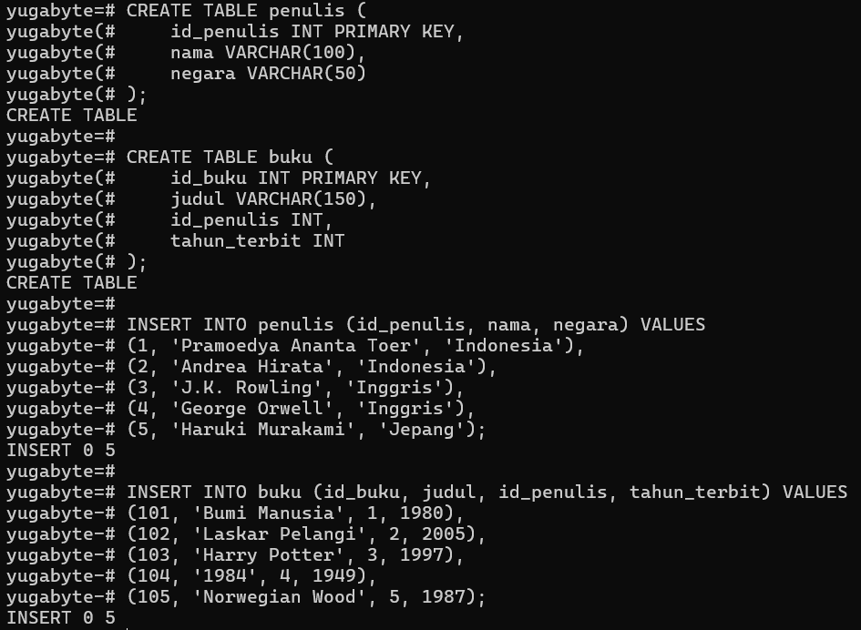
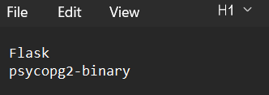
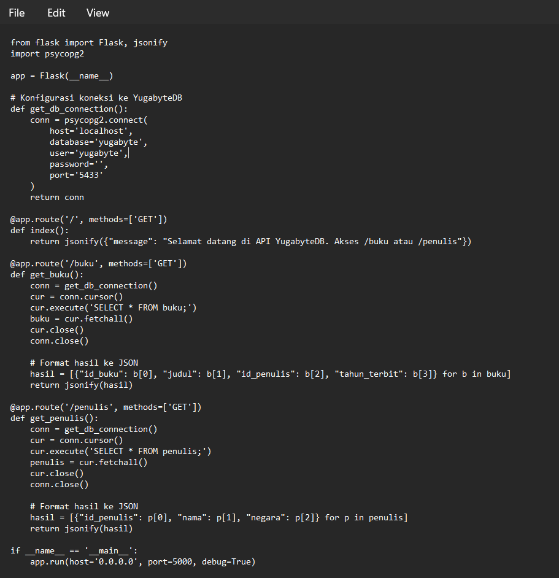
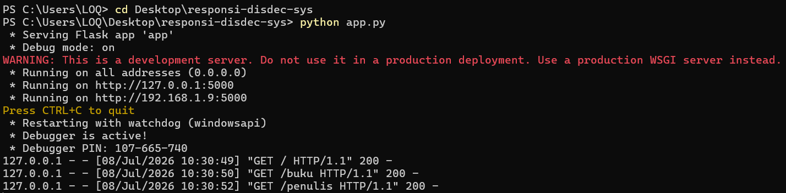
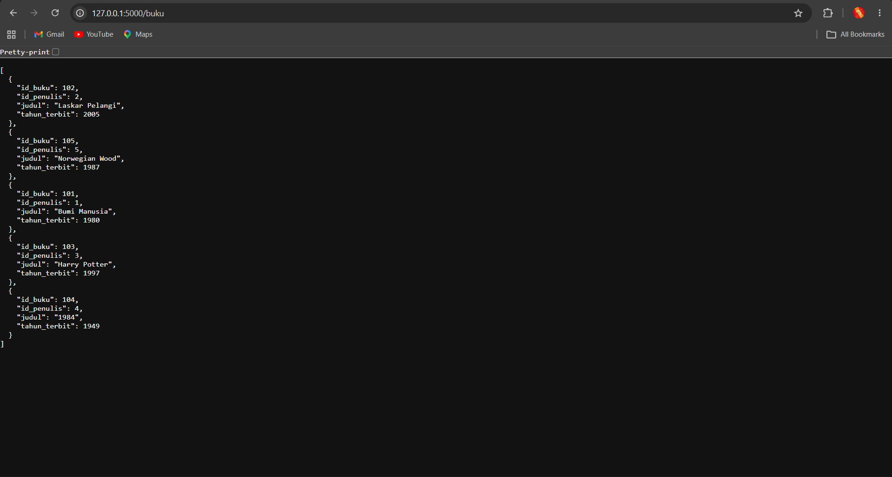
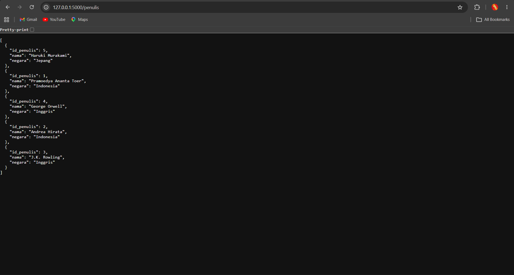

## RESPONSI PRAKTIKUM SISTEM TERDISTRIBUSI DAN TERDESENTRALISASI 

NIM : 235410072

Nama : FAJAR TAUFIK ROMADHON

Mata Kuliah : PRAKTIKUM SISTEM TERDISTRIBUSI DAN TERDESENTRALISASI 

Kelas : IF 1

Dosen : Bambang Purnomosidi D.P., Dr., S.E., Ak., S.Kom., MMSI.

1. (CPMK 1: 20%) Dengan menggunakan Docker, jalankan YugabyteDB dan kemudian buat 2 tabel dengan nama bebas dan isi kolom bebas. Isikan masing-masing 5 data. Buktikan bahwa 2 tabel dibuat dan data juga telah diisikan. Anda bisa menggunakan ysqlsh atau YugabyteDB UI. 

    Menjalankan YugabyteDB menggunakan Docker:
    Perintah ini akan mengunduh dan menjalankan node tunggal YugabyteDB di latar belakang dengan port yang diekspos (5433 untuk SQL).
    
    

    Masuk ke YSQL Shell (ysqlsh):
    

    Membuat Tabel dan Mengisi Data:
    

2. (CPMK 2: 40%) Buatlah REST API menggunakan Python yang akan mengekspos data yang telah anda buat tersebut menggunakan Python. Hasil bisa diakses melalui browser atau headless tool (curl) dalam format JSON.

    Menyiapkan Library (requirements.txt)
    

    Membuat Source Code API (app.py)
    Menggunakan framework Flask untuk membuat server web dan psycopg2 untuk menjembatani komunikasi ke port 5433 (YugabyteDB).
    

    Setelah file siap dan library terinstal (pip install -r requirements.txt), jalankan server API:
    
    
    

    Pada CPMK 2 ini, dibangun sebuah aplikasi middleware (REST API) menggunakan bahasa pemrograman Python dan framework Flask. Fungsi utama dari API ini adalah bertindak sebagai jembatan komunikasi antara database YugabyteDB (yang memegang peran sebagai lapisan penyimpan data) dengan client (sebagai pihak yang meminta data).

    Dengan mengekspos data ke dalam format JSON (JavaScript Object Notation), sistem kita mencapai tingkat Interoperabilitas yang tinggi—salah satu karakteristik utama dari Sistem Terdistribusi. Artinya, data yang berasal dari database kini dapat dibaca dan dikonsumsi oleh aplikasi apapun (baik itu web browser, aplikasi mobile, maupun sistem eksternal lainnya) terlepas dari bahasa pemrograman apa yang mereka gunakan, selama mereka bisa melakukan permintaan via protokol HTTP.

3. (CPMK 3: 40%) Pilihlah blockchain L1 selain Solana. Jelaskan mekanisme konsensus yang digunakan dan buat diagram mekanisme konsensus blockchain tersebut. 

    Pilihan Blockchain L1: Ethereum

    Mekanisme Konsensus: Proof of Stake (PoS) - Protokol Gasper

    Sejak transisi "The Merge" pada September 2022, Ethereum meninggalkan Proof of Work (PoW) dan sepenuhnya menggunakan mekanisme konsensus Proof of Stake (PoS). Secara spesifik, Ethereum menggunakan protokol konsensus gabungan yang disebut Gasper.

    Gasper merupakan kombinasi dari dua komponen algoritma utama:
    * LMD GHOST (Latest Message Driven GHOST): Bertugas sebagai Fork-Choice Rule (aturan pemilihan cabang). Komponen ini menentukan cabang blockchain mana yang paling valid saat terjadi percabangan jaringan dengan cara menghitung jumlah suara (attestation) terbanyak dari para validator.
    * Casper FFG (Friendly Finality Gadget): Bertugas memberikan Finality (kepastian final). Komponen ini secara berkala mengunci blok-blok lama sehingga tidak akan pernah bisa diubah, dibatalkan, atau diretas (mencegah 51% attack).

    Langkah-Langkah Proses Konsensus Gasper (Ethereum PoS):

    - Staking: Seseorang harus mengunci (stake) minimal 32 ETH di dalam smart contract untuk menjadi Validator.
    - Pembagian Waktu: Waktu di Ethereum dibagi menjadi Slot (berdurasi 12 detik) dan Epoch (terdiri dari 32 slot / 6,4 menit).
    - Pemilihan Proposer: Di setiap Slot, algoritma acak (RANDAO) memilih satu validator secara acak untuk menjadi Proposer. Tugasnya adalah mengambil transaksi dari mempool, membuat blok baru, dan menyiarkannya.
    - Attestation (Pemberian Suara): Validator lain yang tidak menjadi Proposer ditugaskan ke dalam komite untuk menjadi Attesters. Mereka memeriksa blok baru tersebut dan memberikan suara bahwa blok tersebut valid (sesuai aturan LMD GHOST).
    - Finalisasi: Setelah sebuah Epoch selesai, Casper FFG mengevaluasi seluruh blok. Jika sebuah checkpoint (batas epoch) mendapatkan persetujuan dari minimal 2/3 total stake validator, maka blok tersebut berstatus Finalized (permanen selamanya).

    Diagram Mekanisme Konsensus Gasper (Ethereum)

    graph TD
    A[Pengguna Mengirim Transaksi] --> B[(Mempool / Antrean Transaksi)]
    B --> C{Algoritma RANDAO   Memilih 1 Proposer}
    
    C -->|Slot Waktu 12 Detik| D[Validator Proposer   Merakit Blok Baru]
    D --> E[Proposer Menyiarkan Blok   ke Jaringan P2P]
    
    E --> F[Komite Validator Lain   Melakukan Pemeriksaan]
    F --> G[Proses Attestation   Aturan LMD GHOST]
    
    G --> H{Mendapat 2/3 Suara?}
    H -->|Tidak Valid| I[Blok Ditolak / Dibuang]
    H -->|Valid| J[Blok Ditambahkan ke Rantai   Status: Justified]
    
    J --> K{Akhir Epoch   32 Slot / 6.4 Menit}
    K --> L[Mekanisme Casper FFG   Mengunci Epoch]
    L --> M(((Blok Menjadi Permanen   Status: Finalized)))
    
    style M fill:#28a745,stroke:#fff,stroke-width:2px,color:#fff
    style I fill:#dc3545,stroke:#fff,stroke-width:2px,color:#fff

